#   APRENDIZAJE NO SUPERVISADO

##  Generador de Video
### *(Redes Generativas Antagónicas)*

**Ingresar al sig. Link de Google colab: https://colab.research.google.com/drive/1go6YwMFe5MX6XM9tv-cnQiSTU50N9EeT#scrollTo=CppIQlPhhwhs**

**Paso 1: Damos clic en conectar**

    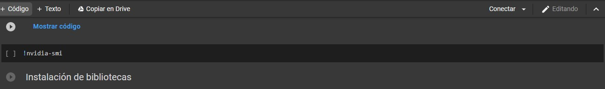

**Paso 2: Seleccionamos el modelo sig.**

    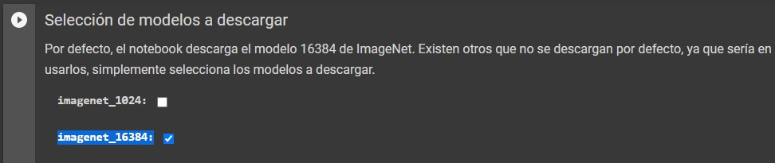

**Paso 3: Parámetros, asignaremos algún texto: en este caso artificial intelligence**

    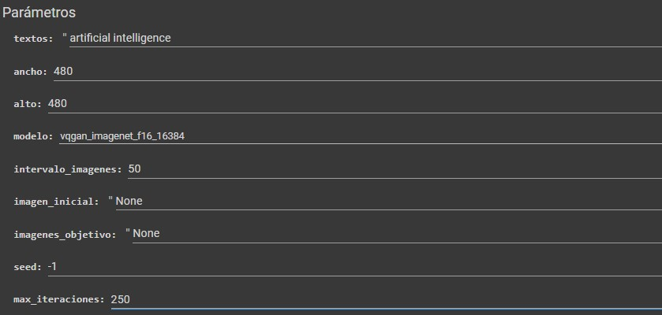

**Paso 4: Ya configurado damos clic en ejecutar todo  ->Ejecutar de todos modos y ESPERAMOS**

    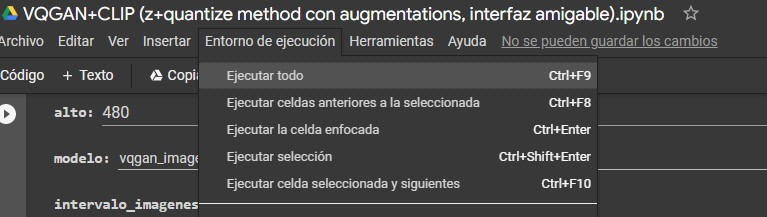

**Paso 5: Se estará generando el video**

    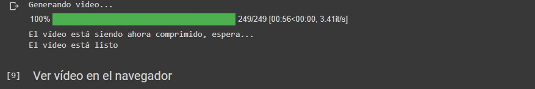

**Paso 6: El video se habrá creado**

    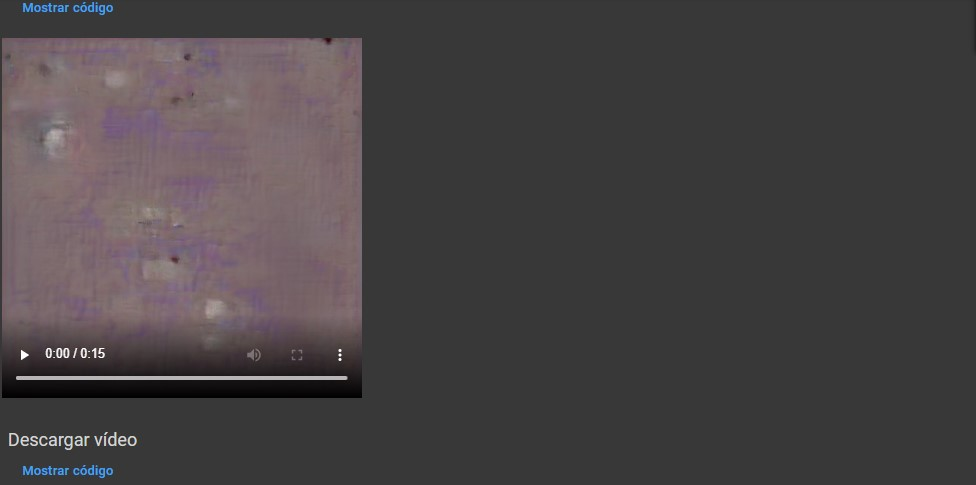

####  <a href="./images/video.mp4">Ver Video</a>

      

##  Generador de Imágenes
### *(Redes Generativas Antagónicas)*

**Paso Delta: Ingresar al sig. Link: https://www.artbreeder.com/**

**Paso 1: Buscar una imagen para basarte**

    

**Paso 2: En la página seleccionamos una imagen, en  mi caso unas que más  o menos se parece:**

    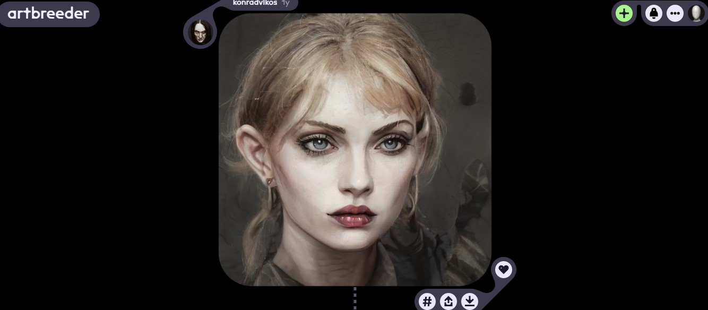

**Paso 3: Daremos clic en agregar otro género (BREED)  -> ADD PARENT, Ya agregando la otra imagen se vería más o menos así:**

    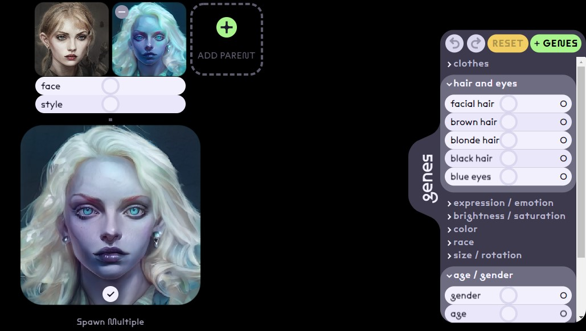

**Paso 4: Agregaremos una tercera imagen**

    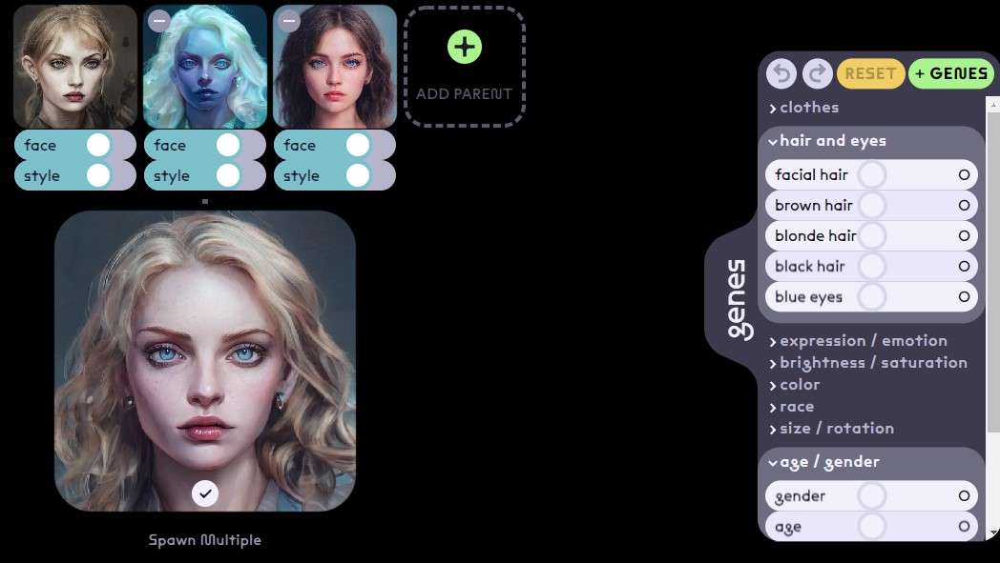

**Paso 5: Agregando una cuarta imagen**

    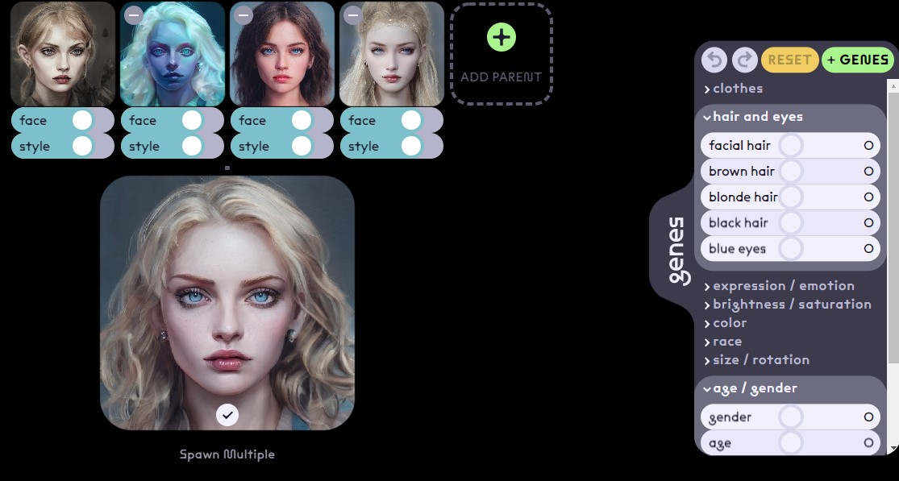

**Paso 6: Resultado**

    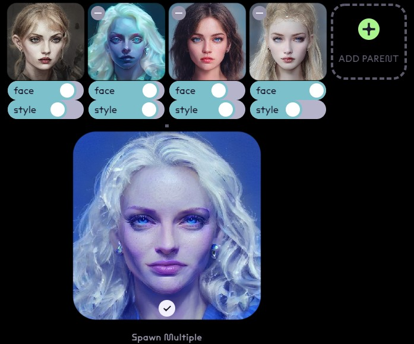

####  <a href="./pdf/2.Aprendizaje no Supervisado.pdf">Ver en formato PDF</a>