#   Azure Machine Learning

**Paso 1: Creamos un recurso de Azure ML**

    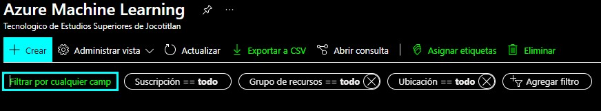

**Paso 2: Agregamos un nuevo Grupo de Recursos, Nombre y una Región : Revisión y Crear**

    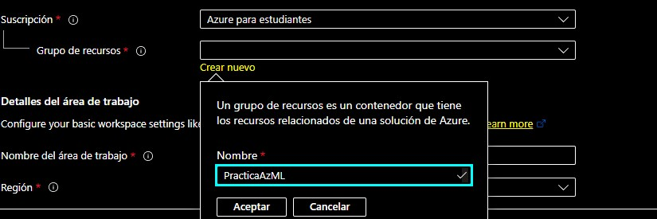

    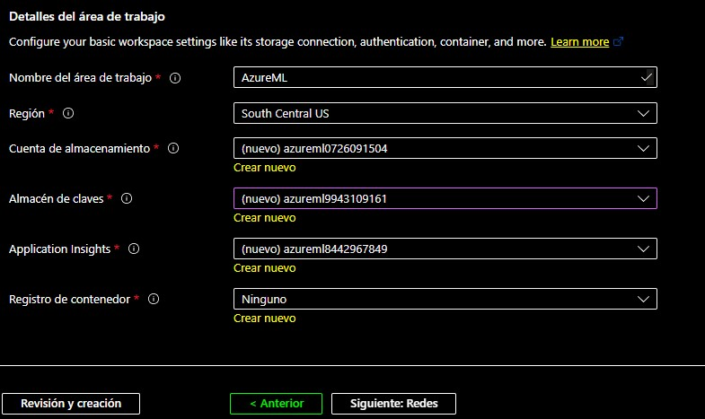

**Paso 3: Una vez resisado el recurso, daremos clic en Crear**

    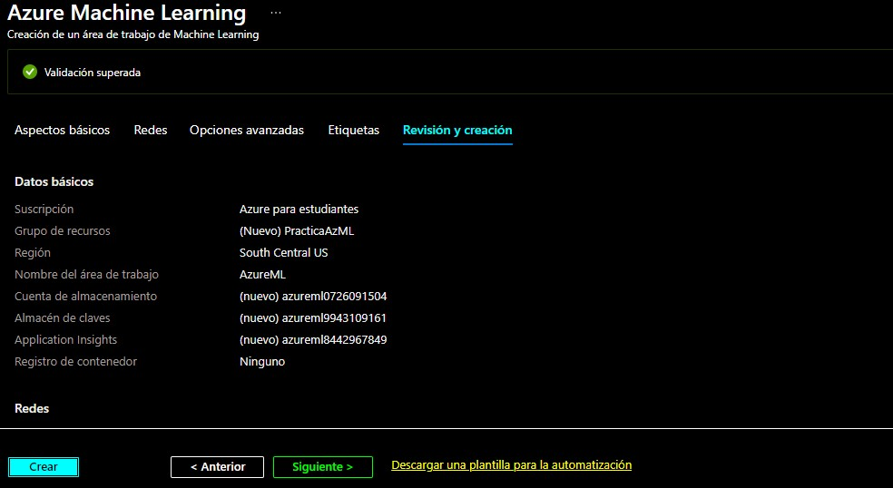

**Paso 4: Esperamos a que se haya completado el proceso de creación e iremos a al recurso**

    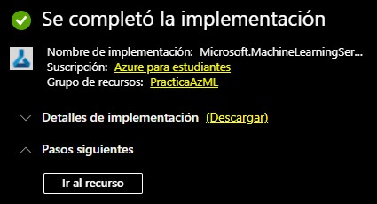

**Paso 5: Ingresamos al sig. Enlace : https://ml.azure.com/home	y podremos visualizar nuestra área de trabajo recién creada e ingresamos en la misma**

    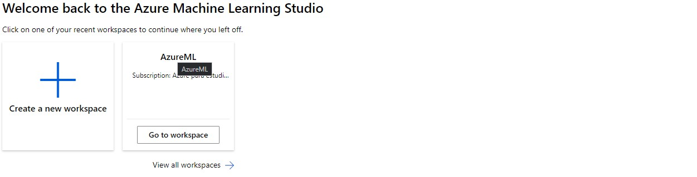

**Paso 6:	Nos dirigimos en procesos (Compute) y damos clic en nuevo**

    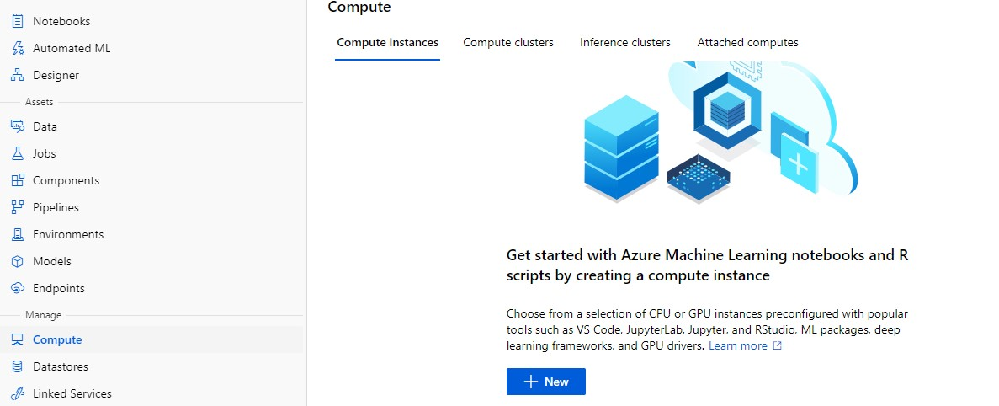

**Paso 7: Le asignamos un nombre y en name -> Standard_DS11_v2 y la creamos**

    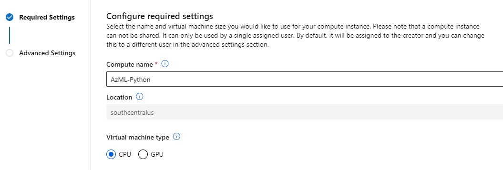

    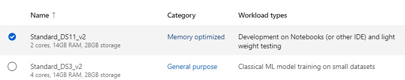

    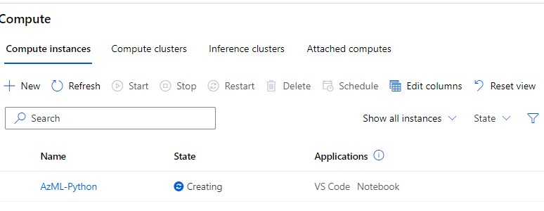

**Paso 8: En esta ocasión ocuparemos un Notebooks para Python online y crearemos nuestro primer programa**

    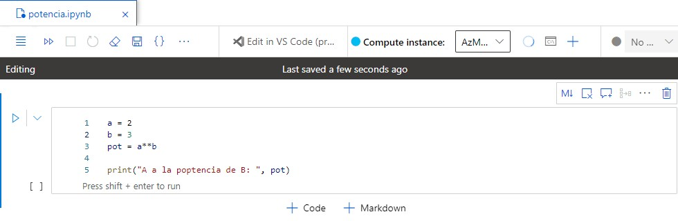

####  <a href="./pdf/3.Azure Machine Learning.pdf">Ver en formato PDF</a>

# FIN