#   Practica 1 – Wordpress

**Paso Delta: Ingresar a  https://portal.azure.com/**

**Paso 1: Dirigirse al apartado de MarketPlace y buscar wordpress y seleccionar la primera opción**

    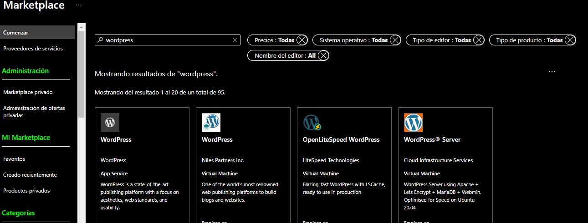

**Paso 2: Presionamos en el botón de crear**

    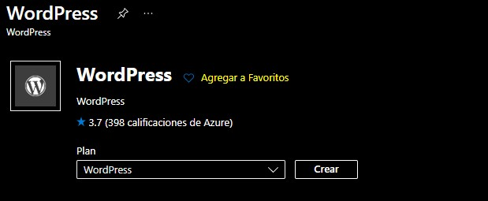

**Paso 3: Creamos un grupo de recursos y le asignamos un nombre**

    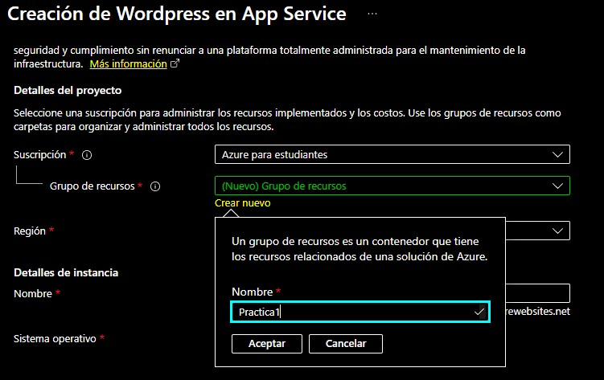

**Paso 4: Configuramos la región y le asignamos un nombre a la instancia**

    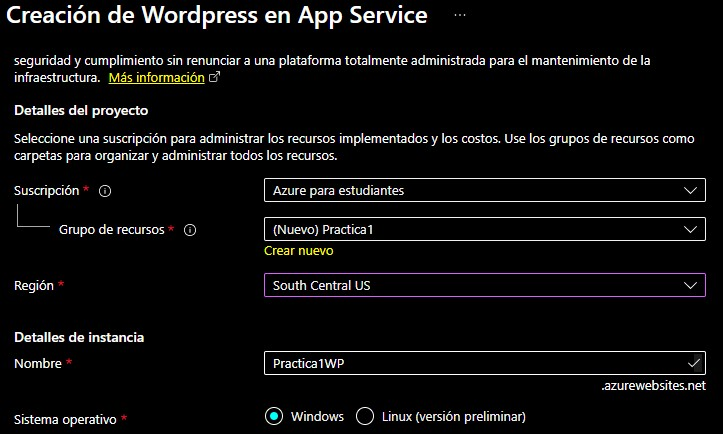

**Paso 5: Nos dirigimos a Etiquetas  (opcional) si se requiere después de algún tipo de info.**

    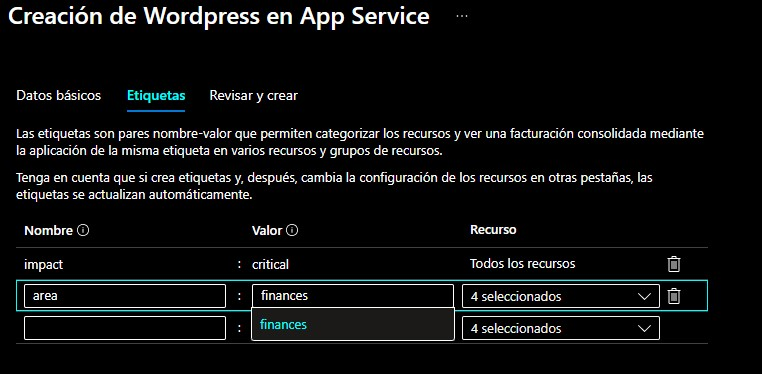

**Paso 6: Hacemos clic en Revisar y Crear**

    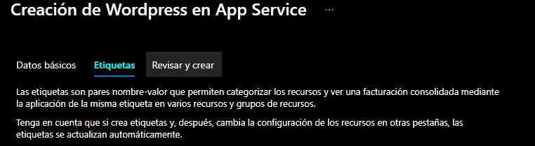

**Paso 7: Hacemos clic en Crear**

    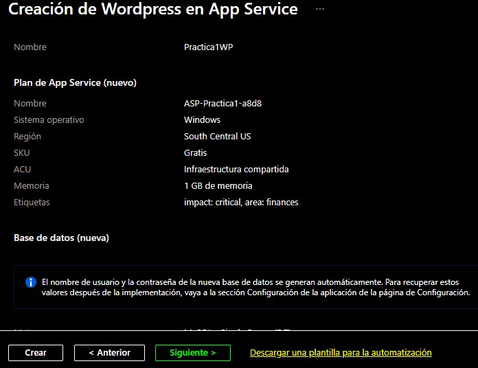

**Paso 8: Dara el sig. Resultado y daremos clic en Ir al recurso**

    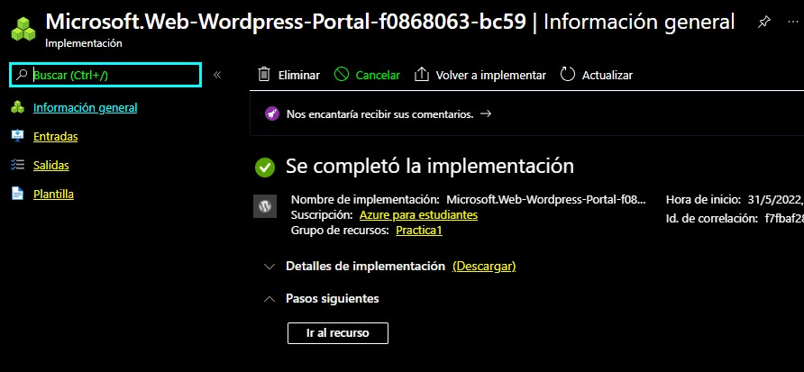

**Paso 9: Para visualizar la pagina creada daremos clic al enlace que nos muestra**

    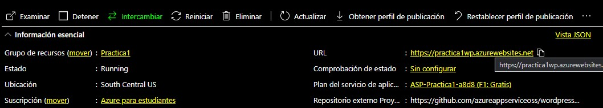

**Paso 10: Ingresaremos los datos para la página y nuestros**

    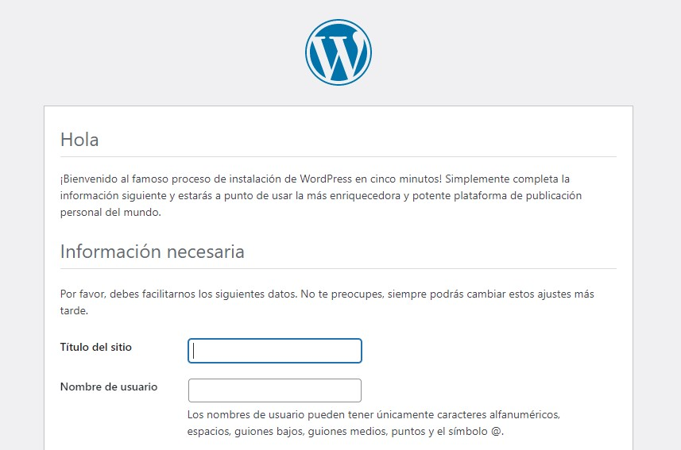

**Paso 11: Una vez configurado la info. Daremos clic en Instalar Wordpress y nos mostraria lo sig.**

    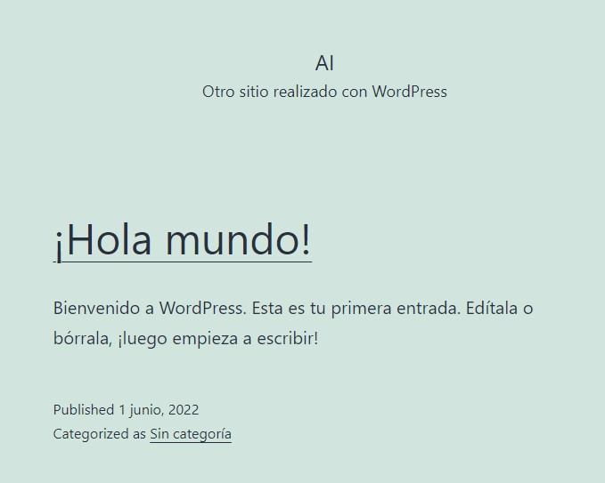

**Para editar la pagina web ingresaremos los sig: urlpagina/wp-admin	e ingresamos**

    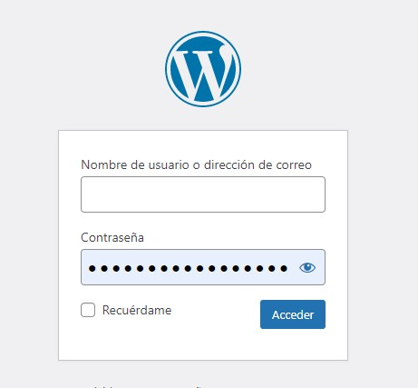

**Podremos visualizar el sig. Panel en donde podremos editar nuestra pagina en WP**

    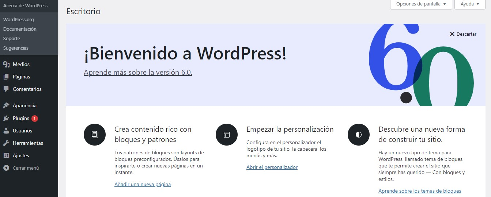

####  <a href="./pdf/P1.Wordpress.pdf">Ver en formato PDF</a>
# FIN