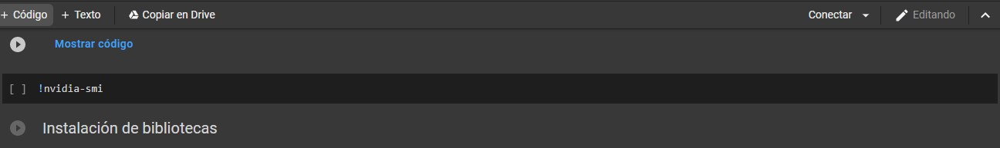

#   APRENDIZAJE NO SUPERVISADO

##  Generador de Video
### *(Redes Generativas Antagónicas)*

**Ingresar al sig. Link de Google colab: https://colab.research.google.com/drive/1go6YwMFe5MX6XM9tv-cnQiSTU50N9EeT#scrollTo=CppIQlPhhwhs**

**Paso 1: Damos clic en conectar**

    

**Paso 2: Seleccionamos el modelo sig.**

    

**Paso 3: Parámetros, asignaremos algún texto: en este caso artificial intelligence**

    

**Paso 4: Ya configurado damos clic en ejecutar todo  ->Ejecutar de todos modos y ESPERAMOS**

    

**Paso 5: Se estará generando el video**

    

**Paso 6: El video se habrá creado**

    

####  <a href="./images/video2.mp4">Ver Video</a>

####  <a href="./pdf/P2.Video.pdf">Ver en formato PDF</a>